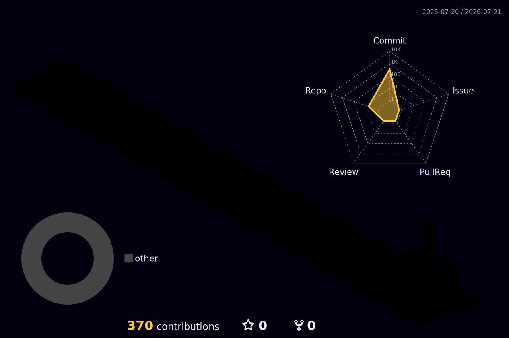

# 👋 Hi there, I'm KiSukNam

### 🌐 Aspiring Network Engineer | 네트워크 엔지니어 지망생

 

🛠️ Hands-on labs with **GNS3** — Routing, Switching, and more  
📚 Building my **network engineering portfolio** through real lab projects  
🎯 Learning by **building & breaking** networks, not just theory  
💼 Background in **PC/OA Support**, transitioning to networking  
  

 

🛠️ GNS3 기반 네트워크 실습 진행 중  
📚 실제 LAB 프로젝트로 포트폴리오 구축 중  
🎯 이론보다 직접 구성하고 트러블슈팅하며 학습  
💼 PC/OA 지원 경력 → 네트워크 분야로 전환 중  

 

---

## 🛠 Tech Stack

  
**🌐 Networking**  

**🧪 Network Simulation & Labs**  

**🔧 Tools & Collaboration**  

---

### 📌 Featured Labs

<!-- REPO-LIST:START -->

&nbsp;  &nbsp;  &nbsp;  &nbsp;  

<!-- REPO-LIST:END -->

---

### 📊 GitHub Stats

---

### 📫 Visitors

