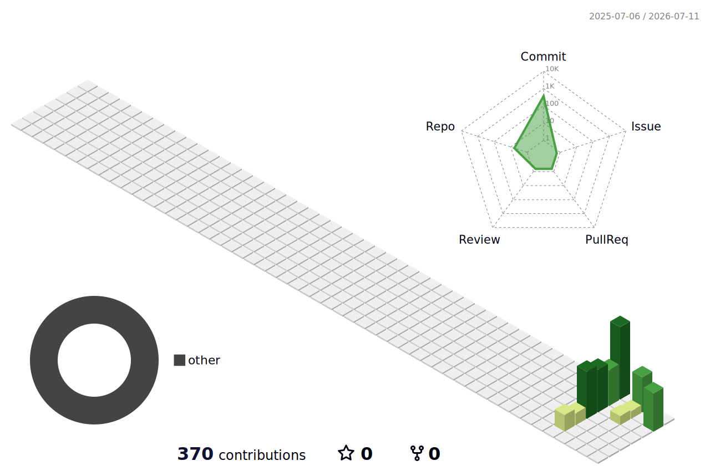

# 👋 Hi there, I'm KiSukNam

### 🌐 Aspiring Network Engineer | 네트워크 엔지니어 지망생

 

🛠️ Hands-on labs with **GNS3** — Routing, Switching, and more  
📚 Building my **network engineering portfolio** on GitHub  
💼 Background in **PC/OA Support**, transitioning to networking  

 

🛠️ GNS3로 네트워크 실습 진행 중  
📚 GitHub에 네트워크 포트폴리오 구축 중  
💼 PC/OA 지원 경력 → 네트워크 분야로 전환 중  

 

---

### 🛠️ Tech Stack

**Networking**
## 🛠 Tech Stack

**🌐 Networking**  

**🧪 Network Simulation & Labs**  

**🔧 Tools & Collaboration**  

---

### 📌 Featured Labs
<!-- REPO-LIST:START -->
<!-- 여기는 Action이 자동으로 채웁니다 -->
<!-- REPO-LIST:END -->

---

### 📊 GitHub Stats

 

---

### 📫 Visitors

