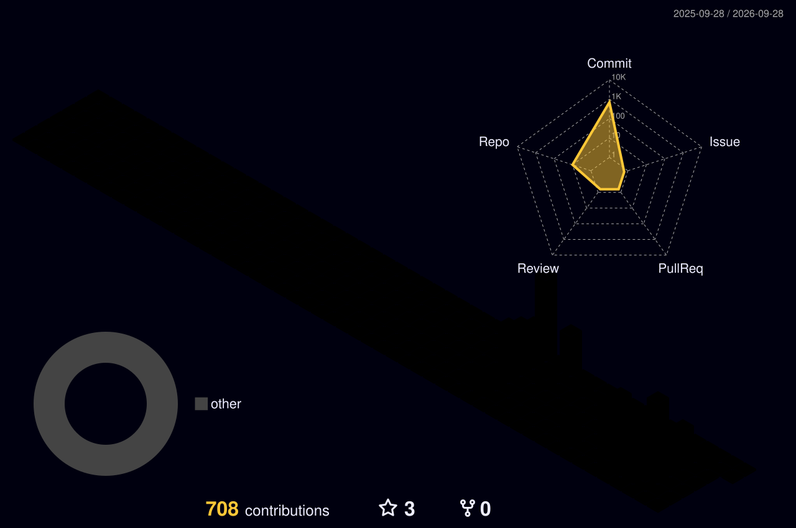

# 👋 안녕하세요, 남기석입니다

### 🌐 Network & Infra Engineer를 준비하고 있습니다

[-GitBook-3884FF?style=for-the-badge&logo=gitbook&logoColor=white)](https://ksnam97.gitbook.io/network_guide/)

[-GitBook-3884FF?style=for-the-badge&logo=gitbook&logoColor=white)](https://ksnam97.gitbook.io/system/)

 

**GNS3 / Cisco IOS** 기반 네트워크 실습을 중심으로  
**Linux · Docker · K8s · Cloud** 까지 인프라 영역을 넓혀가고 있습니다.

*"이론만이 아니라, **직접 구축하고 부숴 보며** 배웁니다."*

---

## 👤 About Me

- 💼 PC/OA 지원 업무 → 네트워크 / 인프라 엔지니어로 전환 준비 중
- 🛠 GNS3 · Cisco IOS 로 라우팅 / 스위칭 / 보안 랩 구성
- 📚 이론은 **GitBook** 에 *책(Guide)* 과 *위키(Wiki)* 두 형식으로 정리하고, 실습은 **[GitHub](https://github.com/KSNAM97?tab=repositories)** 로 관리
- 🎯 목표 : Network + Linux + Cloud Infra Engineer

---

## 🛠 Tech Stack

**🌐 Networking**  

**🧪 Simulation & Labs**  

**🐧 Linux / Infra** *(학습 중)*  

**🔧 Tools**  

---

## 📚 Portfolio Index

이론은 **GitBook**, 실습 결과물은 **GitHub** 에서 확인하실 수 있습니다.

> 📖 **Guide (책)** : 처음부터 순서대로 읽도록 엮은 학습서  
> 🔎 **Wiki (위키)** : 개념·명령어를 주제별로 찾아보는 레퍼런스

| 카테고리 | 내용 | 📖 Guide | 🔎 Wiki |
|---|---|---|---|
| 📗 Network | OSI, 라우팅 / 스위칭, ACL, VPN | [Network Guide](https://ksnam97.gitbook.io/network_guide/) | [Network Wiki](https://ksnam97.gitbook.io/network_wiki/) |
| 📘 Linux | 명령어, 파일 관리, VI, 시스템 설정 | [System](https://ksnam97.gitbook.io/system/) | [System Wiki](https://ksnam97.gitbook.io/system_wiki/) |
| 🐳 Docker | 이미지, 컨테이너, 네트워크, 볼륨 | [System](https://ksnam97.gitbook.io/system/) | [System Wiki](https://ksnam97.gitbook.io/system_wiki/) |
| ☸ Kubernetes | Pod, Service, Deployment, Ingress | [System](https://ksnam97.gitbook.io/system/) | [System Wiki](https://ksnam97.gitbook.io/system_wiki/) |
| 🤖 Ansible | Playbook, Inventory, Role | [System](https://ksnam97.gitbook.io/system/) | [System Wiki](https://ksnam97.gitbook.io/system_wiki/) |
| ☁ Cloud | VPC, EC2, IAM, 네트워크 구성 | [System](https://ksnam97.gitbook.io/system/) | [System Wiki](https://ksnam97.gitbook.io/system_wiki/) |
| 💻 Hands-on Labs | GNS3 / Cisco / Infra 실습 결과물 | [GitHub](https://github.com/KSNAM97?tab=repositories) | - |

---

## 🏢 Featured Projects

| 프로젝트 | 내용 |
|---|---|
| [Cisco DMVPN + IPsec](https://github.com/KSNAM97/cisco-dmvpn-ipsec-network) | DMVPN Phase 2/3 + IPsec, OSPF-EIGRP 재분배, HSRP 이중화, NAT 기반 본사-지사 WAN |
| [Multi-vendor Hybrid Network](https://github.com/KSNAM97/network-project) | Cisco + Arista, DMVPN, ISP 이중화(dual-homing) |
| [Campus Network](https://github.com/KSNAM97/Campus-VLAN-OSPF-NTP-Security) | L2 + L3 + OSPF + NTP + Security 종합 (EtherChannel / VTP / STP / SVI / Inter-VLAN / DoS) |
| [IPsec Network Security Lab](https://github.com/KSNAM97/IPsec-Network-Security-Lab) | IPsec VPN, NAT, CBAC, Reflexive ACL + 통신 보안 이론 정리 |
| [OSPF + ACL Multi-ISP](https://github.com/KSNAM97/OSPF-ACL-Multi-ISP-Network) | OSPF Multi-ISP 백본 + ACL 실습 |
| [EIGRP Multi-ISP](https://github.com/KSNAM97/EIGRP-Multi-ISP-Network) | EIGRP AS 100 Multi-ISP 백본 + Route Summarization |
| [Portfolio Site](https://github.com/KSNAM97/portfolio-site) | React + Supabase + Vercel 로 만든 포트폴리오 사이트 |

---

## 🗺 Learning Roadmap

✅ `Network (GNS3/Cisco)` → 🔄 `Linux` → ⏳ `Docker` → ⏳ `Kubernetes` → ⏳ `Ansible` → ⏳ `Cloud`

---

### 📊 GitHub Stats

<!-- 3D_CONTRIB_START -->

<!-- 3D_CONTRIB_END -->

### 📫 Visitors

